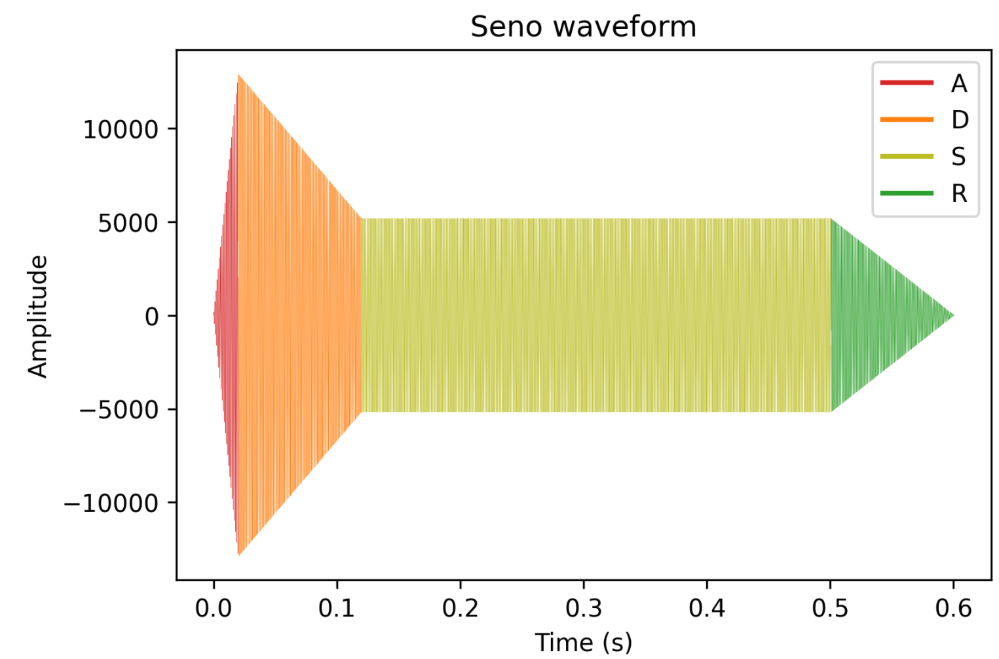
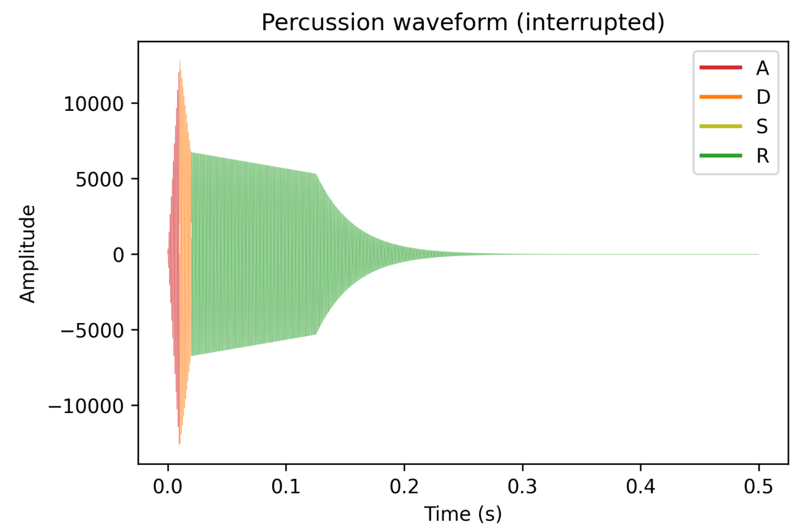
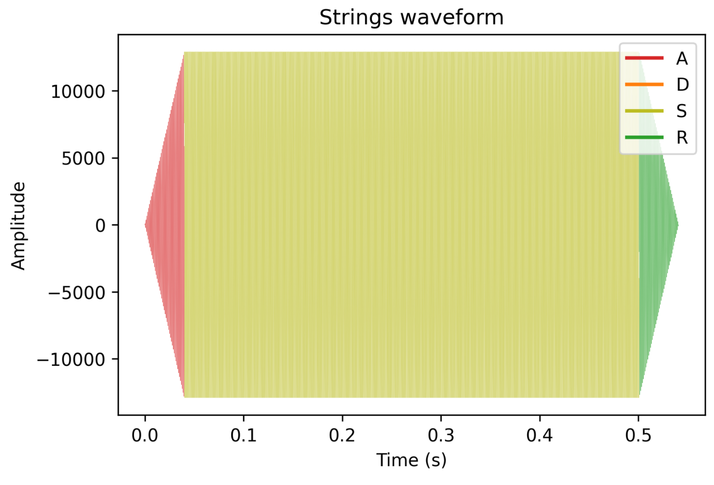
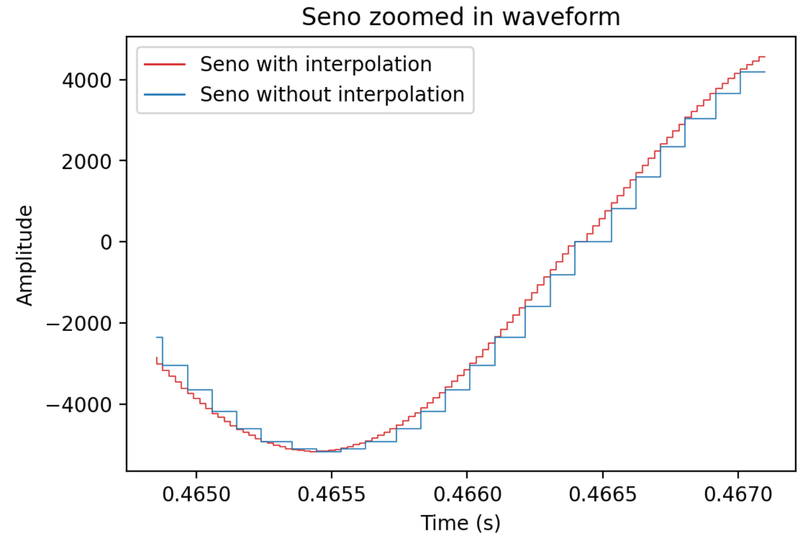
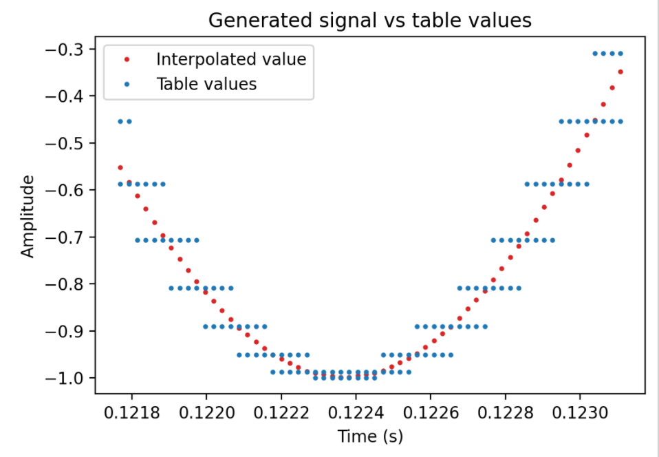
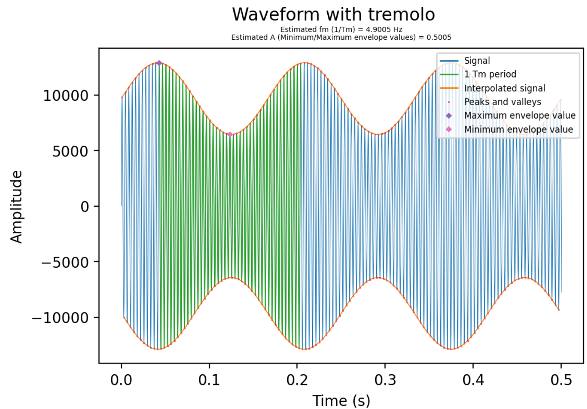
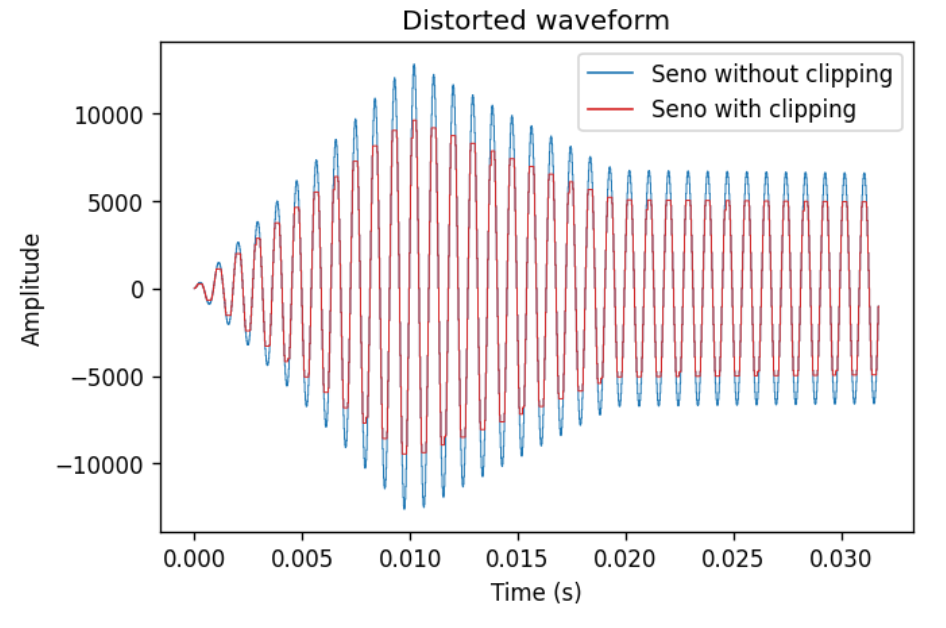

PAV - P5: síntesis musical polifónica
=====================================

Obtenga su copia del repositorio de la práctica accediendo a [Práctica 5](https://github.com/albino-pav/P5) 
y pulsando sobre el botón `Fork` situado en la esquina superior derecha. A continuación, siga las
instrucciones de la [Práctica 2](https://github.com/albino-pav/P2) para crear una rama con el apellido de
los integrantes del grupo de prácticas, dar de alta al resto de integrantes como colaboradores del proyecto
y crear la copias locales del repositorio.

Como entrega deberá realizar un *pull request* con el contenido de su copia del repositorio. Recuerde que
los ficheros entregados deberán estar en condiciones de ser ejecutados con sólo ejecutar:

~~~~~~~~~~~~~~~~~~~~~~~~~~~~~~~~~~~~~~~~~~~~~~~~~~~~~.sh
  make release
~~~~~~~~~~~~~~~~~~~~~~~~~~~~~~~~~~~~~~~~~~~~~~~~~~~~~

A modo de memoria de la práctica, complete, en este mismo documento y usando el formato *markdown*, los
ejercicios indicados.

Ejercicios.
-----------

### Envolvente ADSR.

Tomando como modelo un instrumento sencillo (puede usar el InstrumentDumb), genere cuatro instrumentos que
permitan visualizar el funcionamiento de la curva ADSR.

* Un instrumento con una envolvente ADSR genérica, para el que se aprecie con claridad cada uno de sus
  parámetros: ataque (A), caída (D), mantenimiento (S) y liberación (R).

* Un instrumento *percusivo*, como una guitarra o un piano, en el que el sonido tenga un ataque rápido, no haya mantenimiemto y el sonido se apague lentamente.
  - Para un instrumento de este tipo, tenemos dos situaciones posibles:
    * El intérprete mantiene la nota *pulsada* hasta su completa extinción.
    * El intérprete da por finalizada la nota antes de su completa extinción, iniciándose una disminución
	  abrupta del sonido hasta su finalización.
  - Debera representar en esta memoria **ambos** posibles finales de la nota.

* Un instrumento *plano*, como los de cuerdas frotadas (violines y semejantes) o algunos de viento. En
  ellos, el ataque es relativamente rápido hasta alcanzar el nivel de mantenimiento (sin sobrecarga), y la
  liberación también es bastante rápida.

Para los cuatro casos, deberá incluir una gráfica en la que se visualice claramente la curva ADSR. Deberá
añadir la información necesaria para su correcta interpretación, aunque esa información puede reducirse a
colocar etiquetas y títulos adecuados en la propia gráfica (se valorará positivamente esta alternativa).

#### Instrumento *genérico*

Tanto *InstrumentDumb* como *Seno* usan una envolvente genérica:

<p align="center">

</p

El código usado para representar todas las gráficas de este apartado se encuentra en ``scripts/plot_adsr.py``

#### Instrumento *percusivo*

El instrumento creado con estas características ha sido ``Percussion``, que luego se ha adaptado para tener el pitch adecuado según la nota que se toque (``PercussionPitch``) o bien si se usan *samples*, caso en el que siempre se reproduce el sonido completo sin alteración de pitch (``PercussionSample``)

Su envolvente cuando termina el sonido sin ser interrumpido es la siguiente:

<p align="center">

</p

En el caso de que se produzca una interrupción (la tecla deja de ser pulsada), hemos hecho que decaiga de manera exponencial según avanzan las muestras desde que se haya interrumpido. Cambiando el valor de la constante, podemos conseguir una disminución más o menos abrupta.

```cpp
if (gotInterrupted)
{
  x[i] = x[i] * pow(0.99935, (int)interrupted_count);
  interrupted_count++;
}
```

La envolvente en este caso es: 

<p align="center">
 
 </p

#### Instrumento *plano*

Para este caso, se ha creado la clase ``Strings``. La envolvente resultante es la siguiente:

<p align="center">

</p

  Esta, al igual que ``PercussionPitch`` también ha sido adaptada para tocar las notas correspondientes.
### Instrumentos Dumb y Seno.

Implemente el instrumento `Seno` tomando como modelo el `InstrumentDumb`. La señal **deberá** formarse
mediante búsqueda de los valores en una tabla.

- Incluya, a continuación, el código del fichero `seno.cpp` con los métodos de la clase Seno.

```cpp
Seno::Seno(const std::string &param)
    : adsr(SamplingRate, param)
{
  bActive = false;
  x.resize(BSIZE);

  /*
    You can use the class keyvalue to parse "param" and configure your instrument.
    Take a Look at keyvalue.h    
  */
  KeyValue kv(param);
  if (!kv.to_int("N", N))
    N = 40; //default value

  index = 0;

  std::string file_name;
  static string kv_null;
  int error = 0;
  if ((file_name = kv("file")) == kv_null)
  {
    cerr << "Error: no se ha encontrado el campo con el fichero de la señal para un instrumento FicTabla" << endl;
    throw -1;
  }

  unsigned int fm;
  error = readwav_mono(file_name, fm, tbl);
  if (error < 0)
  {
    cerr << "Error: no se puede leer el fichero " << file_name << " para un instrumento FicTabla" << endl;

    throw -1;
  }
  N = tbl.size();
}

void Seno::command(long cmd, long note, long vel)
{
  if (cmd == 9)
  { //'Key' pressed: attack begins
    bActive = true;
    adsr.start();
    index = 0;
    float f0note = pow(2, ((float)note - 69) / 12) * 440; //convert note from semitones to frequency (Hz)
    float Nnote = 1 / f0note * SamplingRate;              //obtain note period in samples
    index_step = (float)N / Nnote;                        //obtain step (relationship between table period and note period)
    if (vel > 127)
      vel = 127;

    A = vel / 127.;
  }
  else if (cmd == 8)
  { //'Key' released: sustain ends, release begins
    adsr.stop();
  }
  else if (cmd == 0)
  { //Sound extinguished without waiting for release to end
    adsr.end();
  }
}

const vector<float> &Seno::synthesize()
{
  if (not adsr.active())
  {
    x.assign(x.size(), 0);
    bActive = false;
    return x;
  }
  else if (not bActive)
    return x;
  unsigned int index_floor, next_index;
  float weight;
  for (unsigned int i = 0; i < x.size(); ++i)
  {
    //Obtain the index according to the step
    index_floor = floor(index * index_step);
    weight = weight - index_floor;
    //fix second index if needed
    if (index_floor >= (unsigned int)N)
    {
      next_index = 0;
      index_floor = N;
    }
    else
    {
      next_index = index_floor + 1;
    }
    if (index_floor >= tbl.size())
      index = index_floor - tbl.size();
    
    x[i] = A * ((1 - weight) * tbl[index_floor] + (weight)*tbl[next_index]);
  
    index++;
  }
  adsr(x); //apply envelope to x and update internal status of ADSR

  return x;
}
```
Como se puede ver en el código, hemos añadido interpolación lineal para los puntos que no se encontraran en la tabla. Interpolando ahora tenemos la opción de tener en cuenta cómo tratamos el *'reseteo'* del índice a medida que iteramos. En primer lugar, habíamos forzado que el índice, ya tomando valores decimales, fuese forzado a 0 cuando se saliera de la tabla. De este modo, aparece un pequeño desencaje en la sinusoide generada, ya que el valor 0 no es necesariamente la fase que le corresponde (en la gráfica se puede ver como uno de los escalones se repite). Luego, hemos optado resetear el índice con el valor correspondiente (índice actual - N), que posiblemente será 0 con algunos decimales. Esto permite que la fase avance y no se *'resetee'* cada vez que termina de leer la tabla, lo cual produce resultados bastante diferentes en cuanto al sonido.

<p align="center">

</p

Se han incluido las grabaciones de los tres casos en ``ejemplos/`` (`seno_with_index_correction.wav`,`seno_without_index_correction.wav` y `seno_without_interp.wav`).

- Explique qué método se ha seguido para asignar un valor a la señal a partir de los contenidos en la tabla,
  e incluya una gráfica en la que se vean claramente (use pelotitas en lugar de líneas) los valores de la
  tabla y los de la señal generada.
  
  Para obtener los valores de la señal se ha usado una interpolación lineal. Para implementarla, primero obtenemos el entero más cercano a la baja ``index_floor``. Haciendo esto en vez de un ``round``, nos podemos asegurar que siempre estaremos en el mismo caso (el valor almacenado en index_floor será la primera posición entre las que interpolar) y así obtener ``next_index`` sumándole 1. La ponderación para los valores con cada uno de los índices se hace con ``weight``, variable que es la diferencia entre el índice *real* y el entero inferior más próximo, y, a su vez, contiene la información de "como de cerca" están cada una de las dos posiciones, lo cual nos sirve para darle más o menos peso. 

  ```cpp 
  //Obtain the index according to the step
  index_floor = floor(index * index_step);
  weight = index * index_step - index_floor;
  next_index = index_floor + 1;
  x[i] = A * ((1 - weight) * tbl[index_floor] + (weight)*tbl[next_index]);

  ```
  A continuación, podemos ver cada valor interpolado junto a los valores de la tabla que se usan:

   <p align="center">
   
   </p

- Si ha implementado la síntesis por tabla almacenada en fichero externo, incluya a continuación el código
  del método `command()`.

  El método de ``command()`` de ``PercussionSample`` (por ejemplo) es el siguiente:
  ```cpp
  void PercussionSample::command(long cmd, long note, long vel)
  {
    if (cmd == 9)
    { //'Key' pressed: attack begins
      bActive = true;
      index = 0;
      if (vel > 127)
        vel = 127;
      A = vel / 127.;
    }
  }
  ```

  Este es el único caso en que la reproducción nunca se interrumpe o acaba independientemente de los comandos en los *scores*. El envolvente ADSR tampoco tiene ningún efecto sobre la grabación.
  
  El resto de métodos ``command()`` siguen manteniendo los casos específicos según se recibe ``cmd == 8`` o ``cmd == 0``.

  Algo observado al estar usando tablas externas, es que usar notas graves para la tabla suele dar bastantes mejores resultados. Lógicamente, al tener períodos más largos (frecuencias más bajas) tenemos más muestras *reales*, al contrario que las notas agudas, donde se habrá de interpolar más valores sobre una tabla con menos información.

### Efectos sonoros.

- Incluya dos gráficas en las que se vean, claramente, el efecto del trémolo y el vibrato sobre una señal
  sinusoidal. Deberá explicar detalladamente cómo se manifiestan los parámetros del efecto (frecuencia e
  índice de modulación) en la señal generada (se valorará que la explicación esté contenida en las propias
  gráficas, sin necesidad de *literatura*).

  Para esta parte, hemos generado señales usando ``doremi.sco`` (quedándonos con la primera nota) y ajustando ``Seno`` con valores para que el estado *sustain* sea el tramo predominante.

  #### Trémolo 

  El caso del trémolo consiste en escalar la señal con una sinusoide de frecuencia ``fm`` y amplitud ``A``, lo cual se refleja en una variación de amplitud que oscila con esta frecuencia. Con señales sencillas (como la sinusoide ideal que hemos generado), podemos estimar la envolvente que genera esta segunda sinusoide interpolando los máximos y mínimos locales de la sinusoide principal:

   <p align="center">
   
   </p

  *Parámetros: Tremolo A=0.5; fm=4;*

  A partir de la relación entre los máximos y mínimos de la envolvente se puede obtener ``A``. El periodo de la envolvente corresponde al de la señal usada para escalar la sinusoide principal.

  El código para generar esta gráfica y estimar los parámetros se encuentra en ``scripts/tremolo_graph.py``

  #### Vibrato

- Si ha generado algún efecto por su cuenta, explique en qué consiste, cómo lo ha implementado y qué
  resultado ha producido. Incluya, en el directorio `work/ejemplos`, los ficheros necesarios para apreciar
  el efecto, e indique, a continuación, la orden necesaria para generar los ficheros de audio usando el
  programa `synth`.

  El efecto que hemos implementado ha sido la *distorsión*, que consiste saturar la salida por encima de un umbral concreto (*clipping*), lo que, tal como dice el nombre, genera una distorsión audible.

  Para implementarlo, considerando que nuestras señales tienen amplitudes variables (envolvente ADSR), hemos usado una ventana deslizante para que el clipping se realizara de forma local. 

  Los parámetros de entrada desde el fichero `effects` un umbral `t`, que es el porcentaje de la amplitud respecto el cual se hará el clipping, y un tiempo `tm`, que es la duración de la ventana en segundos. Teniendo estos valores en cuenta, se calculan los valores mínimos y máximos de la ventana y se recorta la señal respecto ellos:

  ```cpp
	void Distortion::operator()(std::vector<float> &x)
	{
	  float max, min;
	  int window_count = 0;

	  for (unsigned int i = 0; i < x.size(); i++)
	  {

		//update maximum and minimum clipping value
		if (window_count == 0)
		{
		  max = 0;
		  min = 0;

		  for (unsigned int j = i; j < i + tm; j++)
		  {
			//quit search if the end of x has been reached
			if (j > x.size())
			{
			  break;
			}

			if (max < x[j])
			{
			  max = x[j];
			}
			if (min > x[j])
			{
			  min = x[j];
			}
		  }
		}
		//clip the signal if needed
		if (((max * t) < x[i]))
		{
		  x[i] = max * t;
		}
		if (((min * t) > x[i]))
		{
		  x[i] = min * t;
		}

		window_count++;
		if (window_count > tm)
		{
		  window_count = 0;
		}
	  }
	}
  ```

  Dado a como está implementado, se obtienen mejores resultados con frecuencias altas, ya que garantizan que el máximo de la sinusoide se encuentre en la ventana escogida. Además, en el caso particular de usar `tm`s pequeñas, podemos obtener un *clipping* más suave, que se percibe como una disminución de volumen:

   <p align="center">
   
   </p

  La orden para aplicar los efectos ha sido:

  ```bash
  synth -e work/effects.orc work/percussion.orc work/doremi.sco distortion.wav
  ```
  Los parámetros del efecto en este ejemplo han sido un umbral `t=0.75` y una ventana de `tm=0.01` s para el clipping estándar y `tm=0.0000001` para el soft-clipping.
  Las tres señales generadas se encuentran en `work/ejemplos`. La score usada ha sido `doremi.sco`, donde hay distorsión en todas las notas menos en la penúltima.


### Síntesis FM.

Construya un instrumento de síntesis FM, según las explicaciones contenidas en el enunciado y el artículo
de [John M. Chowning](https://ccrma.stanford.edu/sites/default/files/user/jc/fm_synthesispaper-2.pdf). El
instrumento usará como parámetros **básicos** los números `N1` y `N2`, y el índice de modulación `I`, que
deberá venir expresado en semitonos.

- Use el instrumento para generar un vibrato de *parámetros razonables* e incluya una gráfica en la que se
  vea, claramente, la correspondencia entre los valores `N1`, `N2` e `I` con la señal obtenida.
- Use el instrumento para generar un sonido tipo clarinete y otro tipo campana. Tome los parámetros del
  sonido (N1, N2 e I) y de la envolvente ADSR del citado artículo. Con estos sonidos, genere sendas escalas
  diatónicas (fichero `doremi.sco`) y ponga el resultado en los ficheros `work/doremi/clarinete.wav` y
  `work/doremi/campana.work`.
  * También puede colgar en el directorio work/doremi otras escalas usando sonidos *interesantes*. Por
    ejemplo, violines, pianos, percusiones, espadas láser de la
	[Guerra de las Galaxias](https://www.starwars.com/), etc.

### Orquestación usando el programa synth.

Use el programa `synth` para generar canciones a partir de su partitura MIDI. Como mínimo, deberá incluir la
*orquestación* de la canción *You've got a friend in me* (fichero `ToyStory_A_Friend_in_me.sco`) del genial
[Randy Newman](https://open.spotify.com/artist/3HQyFCFFfJO3KKBlUfZsyW/about).

- En este triste arreglo, la pista 1 corresponde al instrumento solista (puede ser un piano, flautas,
  violines, etc.), y la 2 al bajo (bajo eléctrico, contrabajo, tuba, etc.).
- Coloque el resultado, junto con los ficheros necesarios para generarlo, en el directorio `work/music`.
- Indique, a continuación, la orden necesaria para generar la señal (suponiendo que todos los archivos
  necesarios están en directorio indicado).

También puede orquestar otros temas más complejos, como la banda sonora de *Hawaii5-0* o el villacinco de
John Lennon *Happy Xmas (War Is Over)* (fichero `The_Christmas_Song_Lennon.sco`), o cualquier otra canción
de su agrado o composición. Se valorará la riqueza instrumental, su modelado y el resultado final.
- Coloque los ficheros generados, junto a sus ficheros `score`, `instruments` y `efffects`, en el directorio
  `work/music`.
- Indique, a continuación, la orden necesaria para generar cada una de las señales usando los distintos
  ficheros.
